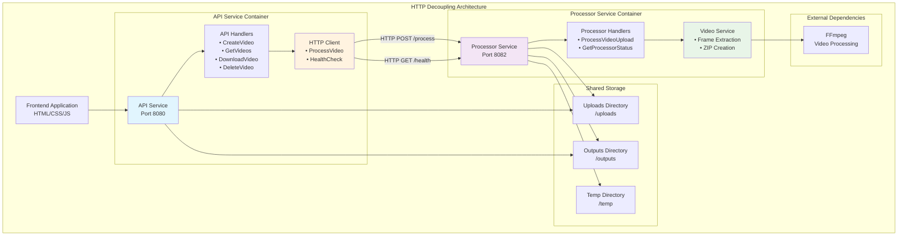

# 🏗️ Arquitetura VideoGrinder - HTTP Decoupling

## 📋 Visão Geral

O **VideoGrinder** evoluiu de uma arquitetura monolítica para uma **arquitetura HTTP decoupling** com dois serviços independentes, preparando o caminho para microserviços. Esta transformação permite maior escalabilidade, isolamento de falhas e manutenibilidade.

## 🎯 Objetivos da Arquitetura

- **🔗 Desacoplamento**: Separar responsabilidades entre API e processamento
- **📈 Escalabilidade**: Permitir múltiplas instâncias do Processor
- **🛡️ Isolamento**: Falhas em um serviço não afetam o outro
- **🚀 Microservices Ready**: Preparar para arquitetura distribuída
- **🧪 Testabilidade**: Testes isolados por responsabilidade

## 🏛️ Diagrama da Arquitetura



## 🎬 Componentes da Arquitetura

### 🎯 API Service (Porta 8080)

**Responsabilidades:**
- Interface externa para clientes (frontend, APIs)
- Gerenciamento de arquivos (upload, download, listagem)
- Validação de requisições HTTP
- Comunicação com Processor Service via HTTP

**Endpoints Principais:**
- `POST /api/v1/videos` - Upload e processamento de vídeo
- `GET /api/v1/videos` - Listagem de vídeos processados
- `GET /api/v1/videos/{filename}/download` - Download de arquivos
- `DELETE /api/v1/videos/{filename}` - Remoção de arquivos

**Tecnologias:**
- **Go + Gin**: Framework HTTP
- **HTTP Client**: Comunicação com Processor
- **Multipart Upload**: Recebimento de arquivos

### ⚙️ Processor Service (Porta 8082)

**Responsabilidades:**
- Processamento de vídeos com FFmpeg
- Extração de frames (1 frame por segundo)
- Criação de arquivos ZIP
- Validação de segurança de arquivos

**Endpoints Principais:**
- `POST /process` - Processamento de vídeo
- `GET /health` - Status de saúde do serviço (status, service, timestamp)

**Tecnologias:**
- **Go + Gin**: Framework HTTP
- **FFmpeg**: Processamento de vídeo
- **ZIP Library**: Compactação de frames

### 🔗 HTTP Client

**Responsabilidades:**
- Comunicação entre API e Processor
- Timeout de 5 minutos para processamento
- Health checks automáticos
- Tratamento de erros HTTP

**Interface:**
```go
type ProcessorClientInterface interface {
    ProcessVideo(filename string, fileReader io.Reader) (models.ProcessingResult, error)
    HealthCheck() error
}
```

## 🔄 Fluxo de Processamento

### 1. **Upload de Vídeo**
```
Frontend → API Service
1. Usuário seleciona arquivo
2. Frontend envia multipart/form-data
3. API valida formato do arquivo
4. API verifica saúde do Processor
```

### 2. **Comunicação HTTP**
```
API Service → Processor Service
1. API cria HTTP request multipart
2. Envia arquivo para /process
3. Processor recebe e valida arquivo
4. Processor retorna resultado JSON
```

### 3. **Processamento de Vídeo**
```
Processor Service → FFmpeg
1. Salva arquivo temporariamente
2. Executa extração de frames
3. Cria arquivo ZIP
4. Remove arquivos temporários
5. Retorna resultado com metadados
```

### 4. **Resposta Final**
```
Processor Service → API Service → Frontend
1. Processor retorna ProcessingResult
2. API propaga resposta para frontend
3. Frontend exibe link de download
```

## 🌐 Comunicação Entre Serviços

### Configuração HTTP
```go
// Client HTTP com timeout configurável
httpClient: &http.Client{
    Timeout: 5 * time.Minute, // Timeout para processamento
}
```

### Health Check

**Processor Service (Padronizado):**
```bash
GET http://localhost:8082/health

Response:
{
  "status": "healthy",
  "service": "videogrinder-processor",
  "timestamp": 1751595012,
  "version": "1.0.0",
  "checks": {
    "directories": {
      "status": "healthy",
      "details": {
        "uploads": { "status": "healthy", "path": "uploads" },
        "outputs": { "status": "healthy", "path": "outputs" },
        "temp": { "status": "healthy", "path": "temp" }
      }
    },
    "ffmpeg": {
      "status": "healthy",
      "latency_ms": 69,
      "last_check": 1751595012
    }
  }
}
```

**API Service (Padronizado):**
```bash
GET http://localhost:8080/health
GET http://localhost:8080/api/v1/health

Response:
{
  "status": "healthy",
  "service": "videogrinder-api",
  "timestamp": 1751595019,
  "version": "1.0.0",
  "checks": {
    "directories": {
      "status": "healthy",
      "details": {
        "uploads": { "status": "healthy", "path": "uploads" },
        "outputs": { "status": "healthy", "path": "outputs" },
        "temp": { "status": "healthy", "path": "temp" }
      }
    },
    "processor": {
      "status": "healthy",
      "url": "http://videogrinder-processor-dev:8082",
      "latency_ms": 50,
      "last_check": 1751595019
    }
  }
}
```

### Padrão de Health Check

**Estrutura Padronizada:**
- `status`: "healthy" | "unhealthy"
- `service`: Nome do serviço (videogrinder-api | videogrinder-processor)
- `timestamp`: Unix timestamp da verificação
- `version`: Versão do serviço
- `checks`: Objeto com verificações específicas por serviço

**Verificações por Serviço:**
- **API Service**: directories + processor connectivity
- **Processor Service**: directories + ffmpeg availability

**Códigos de Resposta:**
- **200 OK**: Todos os checks passaram
- **503 Service Unavailable**: Algum check falhou

## 📦 Estrutura de Código

### Organização por Responsabilidade
```
internal/
├── api/                    # API Service
│   ├── handlers.go         # Handlers HTTP da API
│   └── handlers_test.go    # Testes da API
├── processor/              # Processor Service  
│   ├── handlers.go         # Handlers HTTP do Processor
│   └── handlers_test.go    # Testes do Processor
├── clients/                # HTTP Communication
│   └── processor.go        # Cliente HTTP para Processor
├── services/               # Business Logic
│   ├── video.go           # Lógica de processamento
│   └── video_test.go      # Testes de serviço
└── models/                # Shared Models
    └── types.go           # Tipos compartilhados
```

### Separação de Executáveis
```
├── main.go                # API Service (porta 8080)
└── cmd/processor/main.go  # Processor Service (porta 8082)
```

## 🐳 Deploy e Containerização

### Docker Compose Multi-Service
```yaml
services:
  videogrinder-api-dev:
    build: .
    ports:
      - "8080:8080"
    command: ["go", "run", "main.go"]
    
  videogrinder-processor-dev:
    build: .
    ports:
      - "8082:8082"
    command: ["go", "run", "./cmd/processor"]
```

### Volumes Compartilhados
- **uploads/**: Vídeos enviados pelos usuários
- **outputs/**: Arquivos ZIP processados
- **temp/**: Arquivos temporários durante processamento

## 🧪 Estratégia de Testes

### Testes por Serviço
```bash
make test-api         # Testes da API (14 testes)
make test-processor   # Testes do Processor (6 testes)
make test-services    # Testes de lógica de negócio (8 testes)
make test            # Todos os testes (28+ testes)
```

### Mocks para HTTP
```go
type MockProcessorClient struct {
    healthCheckFunc  func() error
    processVideoFunc func(string, io.Reader) (models.ProcessingResult, error)
}
```

### Testes de Integração
- **API ↔ Processor**: Comunicação HTTP real
- **Processor ↔ FFmpeg**: Processamento de vídeo real
- **End-to-End**: Fluxo completo via Cypress

## 📊 Benefícios Alcançados

### ✅ **Escalabilidade**
- Múltiplas instâncias do Processor podem rodar simultaneamente
- API pode distribuir carga entre processadores
- Processamento paralelo de vídeos

### ✅ **Isolamento de Falhas**
- Crash no processamento não afeta a API
- API continua funcionando mesmo com Processor indisponível
- Degradação graceful do serviço

### ✅ **Manutenibilidade**
- Deploy independente de cada serviço
- Desenvolvimento paralelo por equipes
- Atualizações sem downtime total

### ✅ **Testabilidade**
- Testes unitários isolados por responsabilidade
- Mocks HTTP para testes da API
- Testes de integração específicos

### ✅ **Observabilidade**
- Logs separados por serviço
- Métricas independentes
- Health checks granulares

## 🔮 Próximos Passos

### Fase 3: Persistência
- **DynamoDB**: Metadados de processamento
- **S3**: Armazenamento de arquivos
- **SQS**: Fila de processamento assíncrono

### Fase 4: Microserviços Completos
- **Kubernetes**: Orquestração de containers
- **Service Mesh**: Comunicação entre serviços
- **API Gateway**: Entrada unificada
- **Load Balancer**: Distribuição de carga

## 📝 Configuração de Desenvolvimento

### Executar Arquitetura Completa
```bash
make run              # API + Processor
make logs             # Logs de ambos os serviços
```

### Desenvolvimento Individual
```bash
make run-api          # Apenas API (desenvolvimento frontend)
make run-processor    # Apenas Processor (desenvolvimento backend)
```

### Monitoramento
```bash
curl http://localhost:8080/api/v1/videos  # API health
curl http://localhost:8082/health         # Processor health
```

## 🔧 Variáveis de Ambiente

```bash
# Configuração do Processor Service
export PROCESSOR_URL=http://localhost:8082

# Configuração de diretórios
export UPLOADS_DIR=./uploads
export OUTPUTS_DIR=./outputs
export TEMP_DIR=./temp
```

---

**Esta arquitetura representa um passo fundamental na evolução do VideoGrinder de monólito para microserviços, mantendo a compatibilidade externa enquanto prepara o sistema para escalabilidade futura.**
