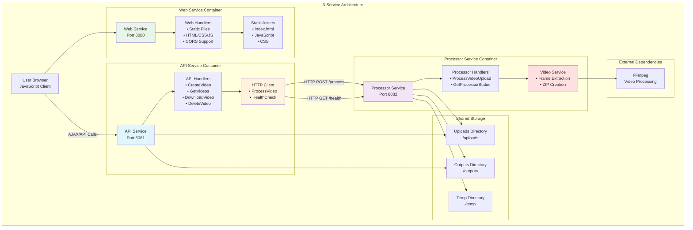

# 🏗️ Arquitetura VideoGrinder - 3-Service Architecture

## 📋 Visão Geral

O **VideoGrinder** evoluiu de uma arquitetura monolítica para uma **arquitetura de 3 serviços independentes**, preparando o caminho para microserviços. Esta transformação permite maior escalabilidade, isolamento de falhas e manutenibilidade, com separação clara entre frontend, API e processamento.

## 🎯 Objetivos da Arquitetura

- **🔗 Desacoplamento**: Separar responsabilidades entre Web, API e processamento
- **📈 Escalabilidade**: Permitir múltiplas instâncias independentes
- **🛡️ Isolamento**: Falhas em um serviço não afetam os outros
- **🚀 Microservices Ready**: Preparar para arquitetura distribuída
- **🧪 Testabilidade**: Testes isolados por responsabilidade
- **🎨 Separação Frontend/Backend**: Interface totalmente desacoplada

## 🏛️ Diagrama da Arquitetura



## 🎬 Componentes da Arquitetura

### 🌐 Web Service (Porta 8080)

**Responsabilidades:**
- Servir arquivos estáticos (HTML, CSS, JavaScript)
- Interface do usuário (frontend)
- Configuração CORS para comunicação com API
- Detecção automática de ambiente (dev/prod)

**Endpoints Principais:**
- `GET /` - Página principal da aplicação
- `GET /static/*` - Arquivos estáticos (CSS, JS, imagens)
- `GET /health` - Status de saúde do Web Service

**Tecnologias:**
- **Go + Gin**: Framework HTTP
- **Static File Serving**: Servir arquivos estáticos
- **CORS**: Permitir chamadas AJAX para API

**Detecção de Ambiente:**
```javascript
// Frontend automaticamente detecta ambiente
if (window.location.port === '8080') {
  // Desenvolvimento: Frontend na 8080, API na 8081
  apiBaseURL = 'http://localhost:8081'
} else {
  // Produção: Mesmo domínio
  apiBaseURL = window.location.origin
}
```

### 🎯 API Service (Porta 8081)

**Responsabilidades:**
- Interface REST para operações de vídeo
- Gerenciamento de arquivos (upload, download, listagem)
- Validação de requisições HTTP
- Comunicação com Processor Service via HTTP

**Endpoints Principais:**
- `POST /api/v1/videos` - Upload e processamento de vídeo
- `GET /api/v1/videos` - Listagem de vídeos processados
- `GET /api/v1/videos/{filename}/download` - Download de arquivos
- `DELETE /api/v1/videos/{filename}` - Remoção de arquivos

**Tecnologias:**
- **Go + Gin**: Framework HTTP
- **HTTP Client**: Comunicação com Processor
- **Multipart Upload**: Recebimento de arquivos

### ⚙️ Processor Service (Porta 8082)

**Responsabilidades:**
- Processamento de vídeos com FFmpeg
- Extração de frames (1 frame por segundo)
- Criação de arquivos ZIP
- Validação de segurança de arquivos

**Endpoints Principais:**
- `POST /process` - Processamento de vídeo
- `GET /health` - Status de saúde do serviço (status, service, timestamp)

**Tecnologias:**
- **Go + Gin**: Framework HTTP
- **FFmpeg**: Processamento de vídeo
- **ZIP Library**: Compactação de frames

### 🔗 HTTP Client

**Responsabilidades:**
- Comunicação entre API e Processor
- Timeout de 5 minutos para processamento
- Health checks automáticos
- Tratamento de erros HTTP

**Interface:**
```go
type ProcessorClientInterface interface {
    ProcessVideo(filename string, fileReader io.Reader) (models.ProcessingResult, error)
    HealthCheck() error
}
```

## 🔄 Fluxo de Processamento

### 1. **Carregamento da Interface**
```
User Browser → Web Service
1. Usuário acessa http://localhost:8080
2. Web Service serve index.html
3. Browser carrega CSS, JavaScript
4. JavaScript detecta ambiente (dev/prod)
```

### 2. **Upload de Vídeo**
```
Frontend JavaScript → API Service
1. Usuário seleciona arquivo
2. JavaScript envia para http://localhost:8081/api/v1/videos
3. API valida formato do arquivo
4. API verifica saúde do Processor
```

### 3. **Comunicação HTTP**
```
API Service → Processor Service
1. API cria HTTP request multipart
2. Envia arquivo para /process
3. Processor recebe e valida arquivo
4. Processor retorna resultado JSON
```

### 4. **Processamento de Vídeo**
```
Processor Service → FFmpeg
1. Salva arquivo temporariamente
2. Executa extração de frames
3. Cria arquivo ZIP
4. Remove arquivos temporários
5. Retorna resultado com metadados
```

### 5. **Resposta Final**
```
Processor Service → API Service → Frontend
1. Processor retorna ProcessingResult
2. API propaga resposta para frontend
3. Frontend exibe link de download
4. Link aponta para http://localhost:8081/api/v1/videos/{file}/download
```

## 🌐 Comunicação Entre Serviços

### Configuração HTTP
```go
// Client HTTP com timeout configurável
httpClient: &http.Client{
    Timeout: 5 * time.Minute, // Timeout para processamento
}
```

### Health Check

**Processor Service (Padronizado):**
```bash
GET http://localhost:8082/health

Response:
{
  "status": "healthy",
  "service": "videogrinder-processor",
  "timestamp": 1751595012,
  "version": "1.0.0",
  "checks": {
    "directories": {
      "status": "healthy",
      "details": {
        "uploads": { "status": "healthy", "path": "uploads" },
        "outputs": { "status": "healthy", "path": "outputs" },
        "temp": { "status": "healthy", "path": "temp" }
      }
    },
    "ffmpeg": {
      "status": "healthy",
      "latency_ms": 69,
      "last_check": 1751595012
    }
  }
}
```

**Web Service (Padronizado):**
```bash
GET http://localhost:8080/health

Response:
{
  "status": "healthy",
  "service": "web"
}
```

**API Service (Padronizado):**
```bash
GET http://localhost:8081/health
GET http://localhost:8081/health

Response:
{
  "status": "healthy",
  "service": "videogrinder-api",
  "timestamp": 1751595019,
  "version": "1.0.0",
  "checks": {
    "directories": {
      "status": "healthy",
      "details": {
        "uploads": { "status": "healthy", "path": "uploads" },
        "outputs": { "status": "healthy", "path": "outputs" },
        "temp": { "status": "healthy", "path": "temp" }
      }
    },
    "processor": {
      "status": "healthy",
      "url": "http://videogrinder-processor-dev:8082",
      "latency_ms": 50,
      "last_check": 1751595019
    }
  }
}
```

### Padrão de Health Check

**Estrutura Padronizada:**
- `status`: "healthy" | "unhealthy"
- `service`: Nome do serviço (videogrinder-api | videogrinder-processor)
- `timestamp`: Unix timestamp da verificação
- `version`: Versão do serviço
- `checks`: Objeto com verificações específicas por serviço

**Verificações por Serviço:**
- **Web Service**: status simples (healthy/unhealthy)
- **API Service**: directories + processor connectivity
- **Processor Service**: directories + ffmpeg availability

**Códigos de Resposta:**
- **200 OK**: Todos os checks passaram
- **503 Service Unavailable**: Algum check falhou

## 📦 Estrutura de Código

### Organização por Responsabilidade
```
internal/
├── api/                    # API Service
│   ├── handlers.go         # Handlers HTTP da API
│   └── handlers_test.go    # Testes da API
├── processor/              # Processor Service  
│   ├── handlers.go         # Handlers HTTP do Processor
│   └── handlers_test.go    # Testes do Processor
├── web/                    # Web Service
│   ├── handlers.go         # Handlers HTTP do Web
│   └── handlers_test.go    # Testes do Web
├── clients/                # HTTP Communication
│   └── processor.go        # Cliente HTTP para Processor
├── services/               # Business Logic
│   ├── video.go           # Lógica de processamento
│   └── video_test.go      # Testes de serviço
└── models/                # Shared Models
    └── types.go           # Tipos compartilhados
```

### Separação de Executáveis
```
├── api/cmd/main.go        # API Service (porta 8081)
├── processor/cmd/main.go  # Processor Service (porta 8082)
└── web/cmd/main.go        # Web Service (porta 8080)
```

### Estrutura Frontend
```
web/
├── static/                # Arquivos estáticos
│   ├── css/styles.css     # Estilos CSS
│   ├── index.html         # Página principal
│   └── js/                # JavaScript
│       ├── api-service.js # Comunicação com API
│       ├── app-controller.js # Controle da aplicação
│       ├── ui-manager.js  # Gerenciamento da UI
│       └── utils.js       # Utilitários
├── tests/                 # Testes JavaScript
│   ├── api-service.test.js # Testes da API
│   ├── app-controller.test.js # Testes do controller
│   ├── ui-manager.test.js # Testes da UI
│   └── utils.test.js      # Testes dos utilitários
├── cypress/               # Testes E2E
├── .eslintrc.js           # Configuração ESLint
├── cypress.config.js      # Configuração Cypress
└── package.json           # Dependências Node.js
```

## 🐳 Deploy e Containerização

### Docker Compose Multi-Service
```yaml
services:
  videogrinder-web-dev:
    build: .
    ports:
      - "8080:8080"
    environment:
      - PORT=8080
      - API_URL=http://videogrinder-api-dev:8081
    command: ["air", "-c", ".air-web.toml"]
    
  videogrinder-api-dev:
    build: .
    ports:
      - "8081:8081"
    environment:
      - PORT=8081
      - PROCESSOR_URL=http://videogrinder-processor-dev:8082
    command: ["air", "-c", ".air-api.toml"]
    
  videogrinder-processor-dev:
    build: .
    ports:
      - "8082:8082"
    environment:
      - PORT=8082
    command: ["air", "-c", ".air-processor.toml"]
```

### Hot Reload Configuration (Air)
```toml
# Pastas excluídas do watch (otimização de performance)
exclude_dir = [
  "tmp", "vendor", "uploads", "outputs", "temp", 
  ".git", "docs", ".github", ".vscode", ".idea",
  "web/node_modules",  # 📦 Dependências Node.js
  "web/cypress",       # 🧪 Testes E2E
  "web/coverage",      # 📊 Relatórios de cobertura
  "coverage"           # 📊 Cobertura Go
]
```

### Volumes Compartilhados
- **uploads/**: Vídeos enviados pelos usuários
- **outputs/**: Arquivos ZIP processados
- **temp/**: Arquivos temporários durante processamento

## 🧪 Estratégia de Testes

### Testes por Serviço
```bash
make test-api         # Testes da API (14 testes)
make test-processor   # Testes do Processor (6 testes)
make test-services    # Testes de lógica de negócio (8 testes)
make test-js          # Testes JavaScript (59 testes)
make test-e2e         # Testes E2E com Cypress (19 testes)
make test            # Todos os testes Go (39+ testes)
```

### Mocks para HTTP
```go
type MockProcessorClient struct {
    healthCheckFunc  func() error
    processVideoFunc func(string, io.Reader) (models.ProcessingResult, error)
}
```

### Testes de Integração
- **API ↔ Processor**: Comunicação HTTP real
- **Processor ↔ FFmpeg**: Processamento de vídeo real
- **End-to-End**: Fluxo completo via Cypress

## 📊 Benefícios Alcançados

### ✅ **Escalabilidade**
- Múltiplas instâncias do Processor podem rodar simultaneamente
- API pode distribuir carga entre processadores
- Processamento paralelo de vídeos

### ✅ **Isolamento de Falhas**
- Crash no processamento não afeta a API
- API continua funcionando mesmo com Processor indisponível
- Degradação graceful do serviço

### ✅ **Manutenibilidade**
- Deploy independente de cada serviço
- Desenvolvimento paralelo por equipes
- Atualizações sem downtime total

### ✅ **Testabilidade**
- Testes unitários isolados por responsabilidade
- Mocks HTTP para testes da API
- Testes de integração específicos

### ✅ **Observabilidade**
- Logs separados por serviço
- Métricas independentes
- Health checks granulares

## 🔮 Próximos Passos

### Fase 3: Persistência
- **DynamoDB**: Metadados de processamento
- **S3**: Armazenamento de arquivos
- **SQS**: Fila de processamento assíncrono

### Fase 4: Microserviços Completos
- **Kubernetes**: Orquestração de containers
- **Service Mesh**: Comunicação entre serviços
- **API Gateway**: Entrada unificada
- **Load Balancer**: Distribuição de carga

## 📝 Configuração de Desenvolvimento

### Executar Arquitetura Completa
```bash
make run              # Web + API + Processor
make logs             # Logs de todos os serviços
```

### Desenvolvimento Individual
```bash
make run-web          # Apenas Web (desenvolvimento frontend)
make run-api          # Apenas API (desenvolvimento API)
make run-processor    # Apenas Processor (desenvolvimento backend)
```

### Monitoramento
```bash
curl http://localhost:8080/health         # Web health
curl http://localhost:8081/api/v1/videos  # API health
curl http://localhost:8082/health         # Processor health
```

## 🔧 Variáveis de Ambiente

```bash
# Web Service (Porta 8080)
export PORT=8080
export API_URL=http://localhost:8081

# API Service (Porta 8081)
export PORT=8081
export PROCESSOR_URL=http://localhost:8082

# Processor Service (Porta 8082)
export PORT=8082

# Configuração de diretórios (compartilhada)
export UPLOADS_DIR=./uploads
export OUTPUTS_DIR=./outputs
export TEMP_DIR=./temp
```

## 📂 Estrutura de Projeto Final

```
videogrinder-processor/
├── api/                     # API Service (Port 8081)
│   └── cmd/main.go         # API Service executable
├── processor/               # Processor Service (Port 8082)
│   └── cmd/main.go         # Processor Service executable
├── web/                     # Web Service (Port 8080)
│   ├── cmd/main.go         # Web Service executable
│   ├── static/             # Frontend assets
│   │   ├── css/styles.css  # Styles
│   │   ├── index.html      # Main page
│   │   └── js/             # JavaScript modules
│   ├── tests/              # JavaScript unit tests
│   ├── cypress/            # E2E tests
│   ├── .eslintrc.js        # ESLint config
│   ├── cypress.config.js   # Cypress config
│   └── package.json        # Node.js dependencies
├── internal/               # Shared Go packages
│   ├── api/                # API handlers
│   ├── processor/          # Processor handlers
│   ├── web/                # Web handlers
│   ├── clients/            # HTTP clients
│   ├── services/           # Business logic
│   ├── config/             # Configuration
│   ├── models/             # Data models
│   └── utils/              # Utilities
├── docker-compose.yml      # Multi-service orchestration
├── Dockerfile              # Container definition
├── Makefile               # Build automation
└── go.mod                 # Go dependencies
```

---

**Esta arquitetura de 3 serviços representa um passo fundamental na evolução do VideoGrinder de monólito para microserviços, com separação completa entre frontend, API e processamento. Mantém a compatibilidade externa enquanto prepara o sistema para escalabilidade futura e permite desenvolvimento independente de cada camada.**
